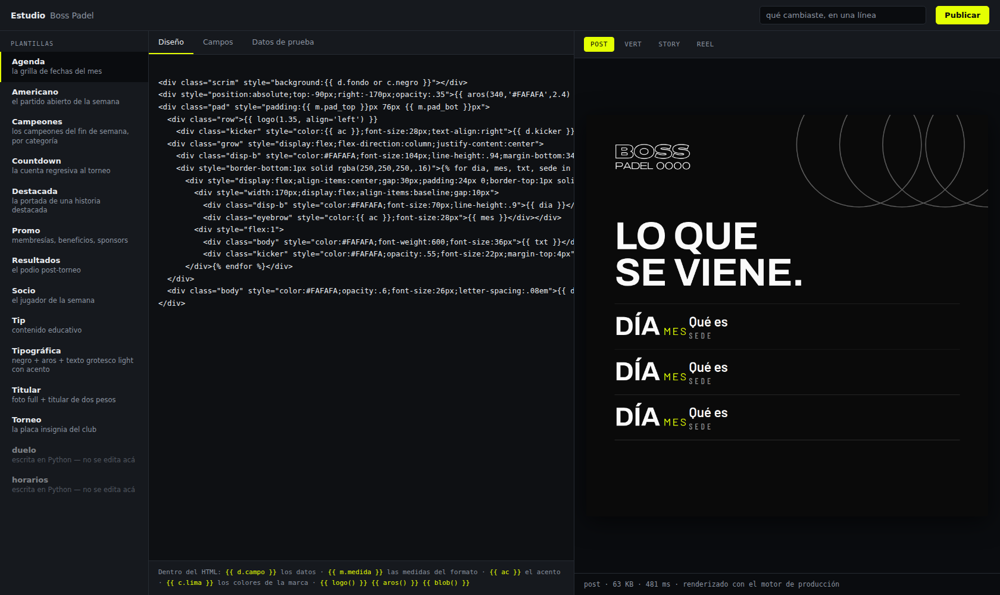
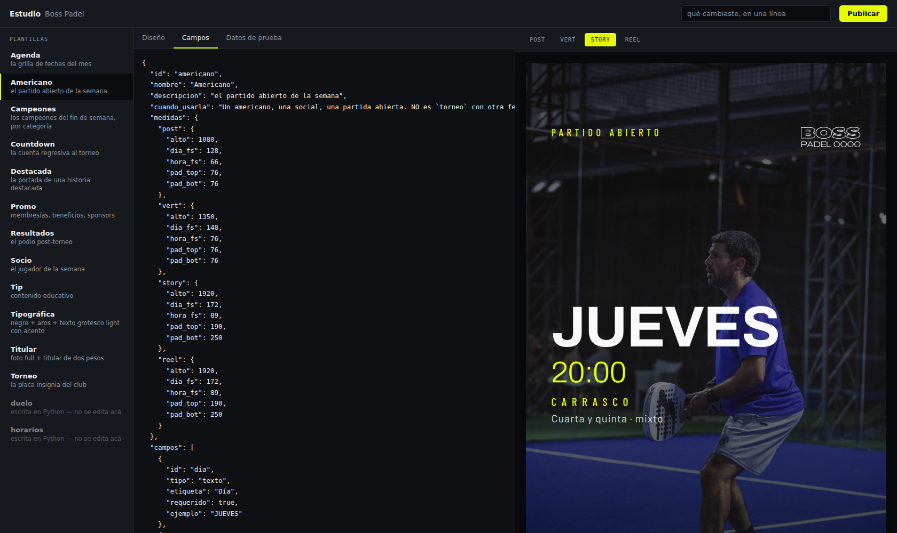

# El estudio

Donde un diseñador abre una plantilla, la corrige viéndola, y la publica.

```bash
python3 -m estudio.servidor boss-padel-disenos     # http://localhost:8080
```



Tres paneles: las plantillas de la marca, el diseño, y la pieza. A la derecha se
cambia de formato y se ve la misma placa en post, vertical, story y reel.



## La regla que sostiene todo esto

**El preview es la pieza.** No se le parece: es la misma.
`motor.plantillas.compilar()` —la función que usa el estudio— es literalmente la
que arma la pieza que sale a Instagram. Mismo Chromium, mismas tipografías
instaladas, misma hoja de estilo de la marca, mismos valores por defecto, mismos
efectos atmosféricos.

Medido, no prometido: se renderizaron las 12 plantillas en sus 4 formatos por el
estudio y por el motor de producción, con los mismos datos, y se compararon los
PNG.

```
48 / 48 idénticos
```

Un preview que dibuja por otro lado se ve bien en el editor y sale distinto en
la pieza. A partir de ahí nadie vuelve a confiar en lo que ve, que es lo único
que hace que un editor sirva para decidir.

## Los datos de prueba se llenan solos

Una plantilla vacía no se puede previsualizar, y pedirle al diseñador que
invente doce campos antes de ver nada es la forma más rápida de que cierre la
pestaña. El contrato ya dice qué es cada campo: alcanza para llenarlo.

Con un detalle que importa: **un campo cuyo valor por defecto es vacío se
muestra vacío.** `contacto` en `torneo` es exactamente eso — la marca dice que
el teléfono NO va salvo que lo pidan, y un preview que lo inventa le enseña al
diseñador lo contrario de lo que tiene que aprender.

La pestaña «Datos de prueba» es editable a propósito: es donde se prueba el
titular largo, la sede con nombre de tres palabras, la lista de ocho ítems. Los
casos que rompen una plantilla no son los del ejemplo.

## Romper algo es lo normal

Mientras alguien edita, la plantilla está rota la mitad del tiempo. Eso no es
una excepción: es el estado habitual del trabajo. El error vuelve como texto
legible al lado del preview —con el número de línea cuando Jinja lo sabe— en vez
de un 500 que deja la pantalla en blanco.

| Lo que se rompe | Lo que se lee |
|---|---|
| una llave sin cerrar | `línea 15: unexpected '/'` |
| un campo que no existe | `'dict object' has no attribute 'sedeee'` |
| un formato que no existe | `la plantilla «torneo» no tiene formato «X». Tiene: post, vert, story, reel` |
| falta un campo requerido | `la plantilla «torneo» necesita: · foto (Foto de fondo)` |

## Publicar

Escribe en la base del cliente y el worker la baja al skill en la corrida
siguiente. El estudio **no toca el disco del contenedor**: sería escribir en una
copia que se pierde en el próximo despliegue.

Pide una etiqueta antes de dejar publicar. No es burocracia — es lo que se va a
leer dentro de seis meses cuando haya que entender por qué la pieza salió así.

## Dos detalles de implementación que no son opcionales

**El navegador vive en su propio hilo.** Playwright sync ata el navegador al
hilo que lo creó y falla con «Cannot switch to a different thread» si lo toca
otro. Un candado no alcanza: el problema no es que entren dos a la vez, es que
entre *otro*. El servidor atiende cada pedido en un hilo distinto, así que el
navegador recibe trabajo por una cola. De paso sale gratis lo que el candado
buscaba: las capturas se hacen de a una y en orden.

**Una marca por proceso.** Igual que el render: dos marcas tienen archivos con
el mismo nombre —`brand.py`, `templates.py`— y no pueden convivir importadas en
el mismo proceso. Para atender a dos clientes se levantan dos procesos, que
además es lo que uno quiere si algún día hay que darle acceso al diseñador de un
cliente y no al del otro.

## Lo que todavía no hace

**Pedir una plantilla nueva en castellano.** Hoy el estudio edita las que
existen; para crear una hay que duplicar una parecida y trabajarla. El paso que
falta es el que convierte «necesito una placa para las clases, con el profe y el
horario» en un borrador con su contrato — y es un llamado al Agent SDK con el
vocabulario de la marca, igual que el diseñador. No está escrito porque no lo
pude probar acá: necesita la clave de Anthropic, y código que llama a un modelo
sin haberlo corrido nunca es exactamente lo que este proyecto aprendió a no dar
por hecho.
